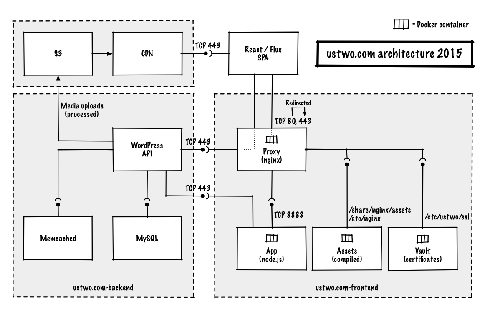

# ustwo.com website

## Overview

This repository contains all the front end code for the current [ustwo.com](https://ustwo.com) website and the toolset required to build and deploy it.

In order to be able to have full control over all aspects of the website – including transitions between pages – and to make navigation super fast by not having to reload the browser, we decided to build the site as a [single-page application](https://en.wikipedia.org/wiki/Single-page_application). We chose [React.js](https://facebook.github.io/react/) as a main JavaScript technology enabling us to do this, since it has built in support to render pages on the server side too (called isomorphic rendering). This way we could keep the loading and rendering performance snappy on mobile and let visitors see content without an extra data loading step after the initial page load. To do this work we put a small Node backend server in place.

Our content management system behind this is a Wordpress instance which doesn't actually render the pages itself, but instead serves content up via [WP API](http://v2.wp-api.org/) through a mixture of standard and customised JSON REST API endpoints making the vast majority of the content editable.

## Tech stack

### React SPA

ES6/7, React.js, Flux

Sass, SVG animations

### Node app

Express, Flux routes

Isomorphic rendering

### Nginx

Reverse proxy

### Build tools

Make, NPM scripts

Browserify, Babel

Autoprefixer, LibSASS

### Browser compatibility

We're aiming to support all evergreen browsers (Chrome, Firefox, Edge and Opera on all platforms), Safari on Mac and iOS, Internet Explorer 10-11 and Android Browser 4.2-4.4.4.

In case you were wondering, we've chosen these as we wanted to be able to use [Flexbox](http://caniuse.com/#feat=flexbox) and they happen to conveniently mostly overlap the visitor profiles from Google Analytics.

If you see any misbehaviour with one of these browsers please open an issue!

## Setup

### Docker dependencies

The project is managed via Docker containers.

Commands below assume OS X and preference to install libraries via Homebrew.
You can of course install Docker Machine and Virtualbox in any other way
you want (like Docker Toolbox / [Kitematic](https://kitematic.com/)).

* Install [Docker Machine](https://docs.docker.com/machine/install-machine/)

        $ brew install docker-machine

* Install [Docker Engine](https://docs.docker.com/installation/)

        $ brew install docker

* Install [Virtualbox](https://www.virtualbox.org/wiki/Downloads)

*Note*: Beware, the version might matter. Our latest known working version is 5.0.4.

### Docker environment

* Create Docker host VM

        $ docker-machine create --driver virtualbox dev

* Set up Docker environment to VM – needs to be done for every new shell session

        $ eval "$(docker-machine env dev)"

* Set up `/etc/hosts` aliases

        192.168.99.100 local.ustwo.com
        192.168.99.100 staging.ustwo.com

*Note*: The IP number above depends on your local instance. Check `docker-machine ip dev`.

### Credentials / Vault

TODO: steps how to run local instance with self certification.

* Get the vault from someone (e.g. arnau@ustwo.com) and load it in your
docker environment.

        $ make vault-load VAULT_PATH=vault-2015.tar

## Develop

*Note*: Check the [Make.md](./Make.md) for an explanation of how the Make
tasks are structured.

Prepare a new environment:

    $ make compiler-build build

Compile the assets (you can use only this when you're only recompiling on front
end stuff):

    $ make stuff

Or target specific subtasks:

    $ make css
    $ make css-watch       # watches for changes in SASS files
    $ make spa             # compiles the react app
    $ make vendors         # compiles the react dependencies

*Note*: `css` and `spa` combined with `VERBOSE=true` will create sourcemaps.

*Note*: `spa` and `vendors` combined with `FLUSH_CACHE=true` will skip any
cache created by browserify. Ex:

    $ make spa VERBOSE=true FLUSH_CACHE=true

Deploy app (when you need to restart services):

    $ make -i love LOCAL_FS=true VERBOSE=true

*Note*: Add the flag `LOCAL_FS=true` if you want to use your local files instead
of the ones inside the containers.
*Note*: Add the flag `VERBOSE=true` if you want the JS and CSS expanded.

As long as `LOCAL_FS=true` is set a convenient way to refresh the environment
is:

    $ make -i love stuff LOCAL_FS=true

As it will rebuild the assets (`stuff`) and recreate the containers (`love`)
remounting all necessary files from the host environment.

Clean the environment:

    $ make clean

See Node app logs with:

    $ make app-log

And Nginx logs with:

    $ make proxy-log

## Test

Run all tests:

    $ make test

### Sandbox

We believe that every component should hold a single responsibity, and which functionality must be working independently from the context the component is instanciated in.

To enforce best practices, like storing functionality and styles in the component they belong to, we created a sandbox to test components in an isolated environment.

To prepare the sandbox run:

    $ make sandbox-build

And start the sandbox server with:

    $ make -i sandlove LOCAL_FS=true

The sandbox will be available at `local.ustwo.com:9443/sandbox`

### Unit

We're using Mocha + Chai + Sinon to run unit tests against JSDOM as this setup works well with React and executes fast.

Run the unit tests:

    $ make assets-test

### Integration

To keep setup simple and still be able to test Internet Explorer and mobile browsers running on real devices, we're running integrations tests using Sauce Labs with a Sauce Connect tunnel. This unfortunately means that if you want to be able to run these tests, you'll need to create an account and set up `SAUCE_USERNAME` and `SAUCE_ACCESS_KEY` as environment variables.

Also to minimise context switching, we're running our simple sanity testing suite using Mocha + Chai + Chai Promises + WD.js.

Run the integration tests:

    $ make assets-integration

## Release

We're using Docker Hub and Docker Machine to tag and deploy Docker images, for more info see [RELEASE.md](./RELEASE.md).

## Contribution

To read up on our coding style and general contribution guide, have a look at [CONTRIBUTING.md](./CONTRIBUTING.md).

## Sandbox / component style guide

TODO

## Contact / credits

TODO: who to best talk to about various aspects

## License – probably best as LICENSE.md
